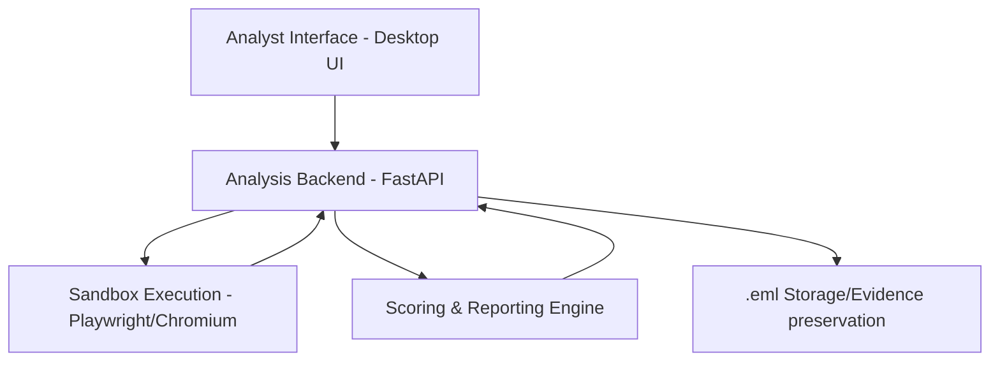

# DESIGN: Dynamic Email Sandbox Analysis System (DESAS)

## 1. Introduction
DESAS is an isolated email investigation workstation designed to assist SOC analysts in the dynamic detonation and analysis of suspicious emails. It bridges the gap between static detection and manual investigation by providing a controlled, automated sandbox for observing real-time malicious behavior.

## 2. Architectural Overview
DESAS follows a layered architecture, optimized for isolation and analyst-driven feedback loops.

### 2.1 Component Description
- **Analyst Interface**: A local web interface (FastAPI/JS) for file upload and result visualization.
- **Analysis Backend**: Orchestrates the analysis flow, manages the sandbox lifecycle, and stores results.
- **Sandbox Execution Layer**: Uses Playwright with Headless Chromium to navigate URLs extracted from emails, monitoring DOM mutations and network traffic.
- **Scoring & Reporting Engine**: A rule-based engine that maps observed behaviors to risk scores and MITRE ATT&CK techniques.

## 3. Core Processing Logic

### 3.1 Static Analysis Phase
- **Header Inspection**: Validation of SPF, DKIM, and DMARC status.
- **Entity Extraction**: Regex-based extraction of URLs and attachment metadata.
- **Normalization**: URL expansion (un-shortening) and de-obfuscation.

### 3.2 Dynamic Sandbox Phase
The heart of DESAS is the **Runtime DOM Mutation Detection**.
- **Execution**: URLs are opened in a fresh, ephemeral browser context.
- **Observation**:
    - **Network Traffic**: Intercepting XHR/Fetch calls, POST requests to unknown domains.
    - **DOM Changes**: Detecting the injection of password fields or login forms after initial page load (evading static scanners).
    - **Redirects**: Monitoring complex redirect chains (e.g., JS-based redirects).

## 4. Scoring Engine
Unlike black-box ML systems, DESAS uses deterministic scoring for transparency.

| Indicator | Suspicion Level | Rationale |
|-----------|-----------------|-----------|
| URL Shortener | Low | Often used in phishing to hide destination. |
| Redirect Chain > 3 | Medium | Common in affiliate malware/malvertising. |
| Password Field Injection | High | Strong indicator of credential harvesting. |
| POST to Non-Root Domain | High | Evidence of data exfiltration. |

## 5. Security and Isolation
- **Network Isolation**: The VM environment has no access to the corporate internal network.
- **Ephemeral Contexts**: Every analysis run uses a clean browser state; no cookies or local storage persist.
- **Execution Limits**: Time-boxed execution (e.g., 30s) prevents infinity loops or resource exhaustion.
- **Reset Mechanism**: Designed for Proxmox snapshots to allow instant rollback to a clean state.

## 6. Conclusion
DESAS is designed as a focused, surgical tool for the SOC, emphasizing explainability and safety over mass automation.
