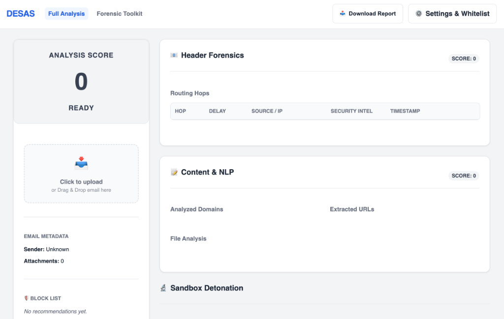

# DESAS — Dynamic Email Sandbox Analysis System


DESAS is a production-grade **Dynamic Email Sandbox Analysis System** designed for high-fidelity forensic investigation of suspicious emails and attachments. It transforms complex phishing attempts into actionable intelligence through automated sandbox detonation, deep file forensics, and multi-format content extraction.

---

## 🖥 Desktop Application

DESAS is built as a robust **Electron-based Desktop Application** for seamless analyst workflows:

- ✅ **Integrated Backend**: Automatically spawns Python FastAPI analysis engine on startup.
- ✅ **Cross-Platform**: Optimized for Windows and macOS (Apple Silicon & Intel).
- ✅ **Advanced Forensics**: Real-time detection of polyglots, appended payloads, and XLM macros.
- ✅ **Multi-Format Extraction**: Automatic OCR and text parsing for PDF, DOCX, and Excel.
- ✅ **MITRE ATT&CK Integration**: Automatic mapping of threats to industry-standard techniques.

---

## 📸 Screenshots

### Main Analysis Interface

*Comprehensive email analysis with header forensics, content analysis, and sandbox detonation.*

### Forensic Toolkit

*Standalone tools for rapid domain intelligence, URL sandbox, and deep attachment analysis.*

---

## 🛡 Advanced Forensic Capabilities

The DESAS engine identifies sophisticated evasion techniques used by modern threat actors:

| Capability | Description | MITRE Mapping |
|:---|:---|:---|
| **Polyglot Detection** | Detects files masquerading as multiple formats (e.g., PDF starting with a PE signature). | T1027.001 |
| **Appended Payloads** | Identifies malicious scripts or executables hidden after valid image EOF markers. | T1027.001 |
| **OLE Stream Audit** | Deep scans OLE containers for `MBDG`, `Package`, and Equation Editor exploits. | T1204.002 |
| **XLM Macro Hunting** | Detects Legacy Excel 4.0 macros (`EXEC`, `REGISTER`) used for stealth. | T1059 |
| **Image Forensics** | Heuristic entropy checks and metadata analysis for steganography detection. | T1497 |

---

## 📂 Project Structure

```
DESAS/
├── app/                      # Core Application Logic
│   ├── analyzer/             # Email Parsing & Intelligence Modules
│   │   ├── eml_parser.py     # .eml file parser
│   │   ├── msg_parser.py     # Outlook .msg parser
│   │   ├── headers.py        # SPF/DKIM/DMARC analysis
│   │   ├── body.py           # URL extraction & VirusTotal checks
│   │   ├── attachments.py    # Main attachment analysis pipeline
│   │   ├── forensics.py      # [NEW] Advanced signature & signal detection
│   │   ├── url_extractor.py  # OCR and deep URL scraping
│   │   └── mxtoolbox.py      # MxToolbox API integration
│   ├── core/                 # Configuration & Data Models
│   │   ├── config.py         # Environment & API management
│   │   └── scoring.py        # Verdict calculation logic (MITRE-aligned)
│   ├── sandbox/              # Detonation Engine
│   │   └── browser.py        # Playwright browser automation
│   ├── api/                  # FastAPI Endpoints
│   │   └── endpoints.py      # Analysis, reporting, and toolkit routes
│   └── templates/            # Electron UI (HTML/CSS/JS)
├── build_assets/             # Build Configuration & Spec Files
├── docs/                     # Documentation Suite (Design, Guides)
├── samples/                  # Curated Forensic Test Samples
├── main.js                   # Electron Main Process
├── package.json              # App configuration & dependencies
└── requirements.txt          # Backend dependencies (openpyxl, pdfminer, etc.)
```

---

## 🛠 Technology Stack

| Layer | Technology | Purpose |
|-------|------------|---------|
| **Frontend** | Electron + Vanilla CSS/JS | High-performance, low-dependency desktop UI |
| **Backend** | FastAPI (Python 3.12+) | Async RESTful analysis engine |
| **Detonation** | Playwright (Chromium) | Isolated browser sandbox for URL inspection |
| **OCR** | Tesseract OCR | Visual text extraction from phishing screenshots |
| **Extraction** | `openpyxl`, `python-docx`, `pdfminer.six` | Multi-format office document parsing |
| **Intelligence** | VirusTotal, MxToolbox, IP-API | Global threat reputation & DNS validation |
| **Forensics** | `olefile`, `hashlib`, Custom Heuristics | Deep object analysis and polyglot detection |

---

## 🚀 Quick Start

### Prerequisites
- **Python 3.12+**
- **Node.js 20+**
- **Tesseract OCR**: Required for image text extraction (`brew install tesseract` on Mac).
- **Playwright**: Installed via `playwright install chromium`.

### Installation

1. **Clone and Install**
   ```bash
   git clone <repository-url>
   cd DESAS
   pip install -r requirements.txt
   npm install
   ```

2. **Configure Environment**
   ```bash
   cp .env.example .env
   # Add your API keys (VT_KEY, MX_KEY, etc.)
   ```

3. **Run for Development**
   ```bash
   npm start
   ```

4. **Build Production DMG/EXE**
   ```bash
   # macOS
   ./build_macos.sh
   
   # Windows
   build_windows.bat
   ```

---

## 🛡 Security & Isolation

DESAS follows the "Clean Room" analysis principle:
- ✅ **Ephemeral Sandboxes**: Browser contexts are wiped after every detonation.
- ✅ **Strict Egress Control**: Intelligence API calls are the only permitted outbound traffic.
- ✅ **No Local DB**: Forensic data is kept in-memory or exported as PDF, reducing local footprint.
- ✅ **Process Isolation**: The backend server runs as a separate process from the UI for stability.

---

## 📖 Documentation Suite

- [**USER_GUIDE.md**](./docs/USER_GUIDE.md): Comprehensive analyst guide for all app features.
- [**DESIGN.md**](./docs/DESIGN.md): Technical architecture and data flow.
- [**SUMMARY.md**](./docs/SUMMARY.md): Strategic value for SOC managers.
- [**WALKTHROUGH.md**](./docs/WALKTHROUGH.md): Step-by-step forensic investigation guide.
- [**WINDOWS_BUILD_GUIDE.md**](./docs/WINDOWS_BUILD_GUIDE.md): Detailed Windows packaging instructions.

---

**DESAS**: *Transforming suspicious emails into actionable forensic intelligence.*
